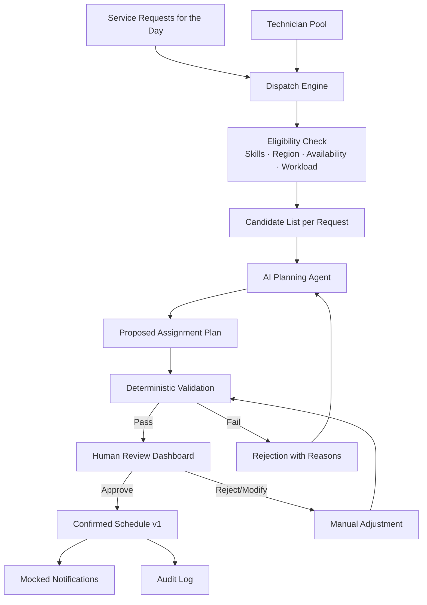
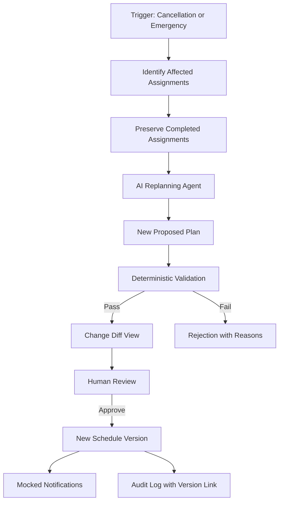
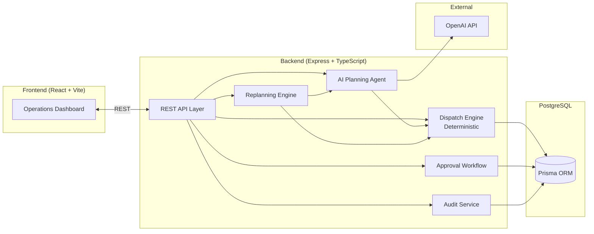
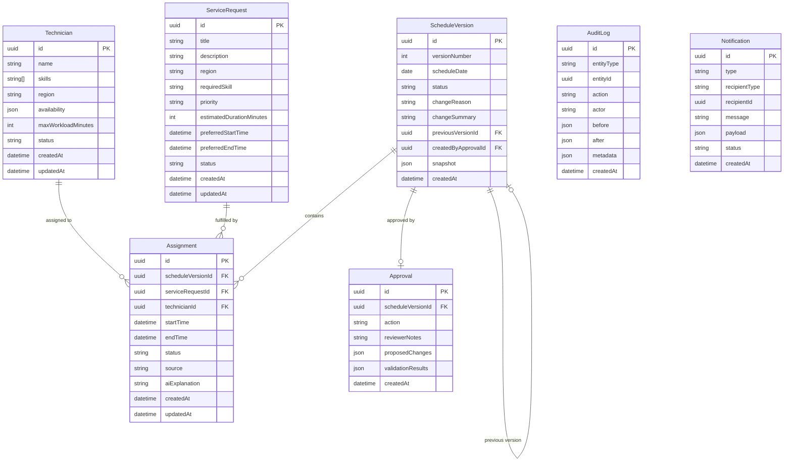
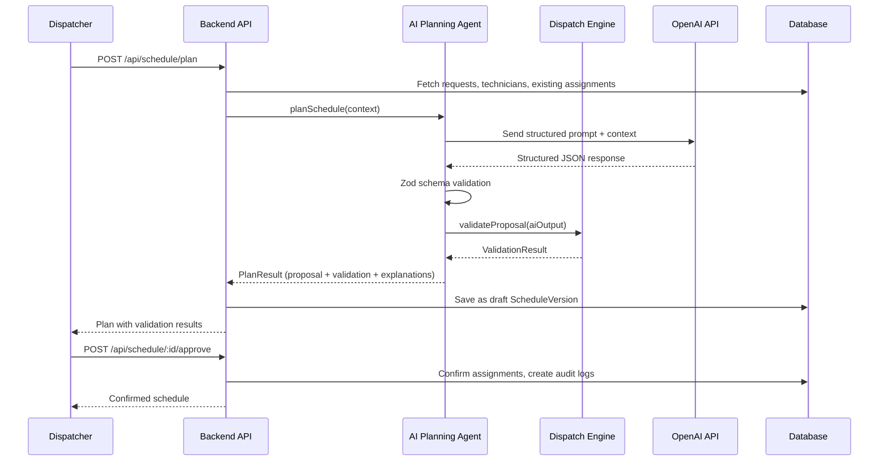
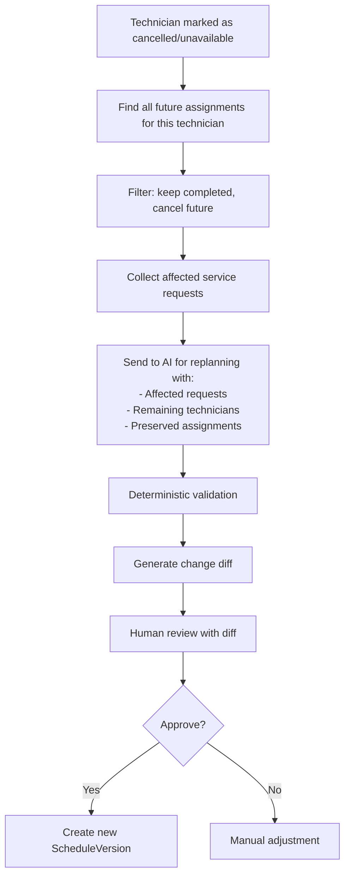

# Field Service Dispatch and Replanning Agent — Implementation Blueprint

> **Assessment:** Aggroso Candidate Assessment — Problem 2 (Expert)
> **Expected focused effort:** 7–10 hours
> **Time remaining:** ~46h 52m
> **Date:** 2026-10-06

---

## Table of Contents

1. [Requirements Matrix](#1-requirements-matrix)
2. [Core Domain Model](#2-core-domain-model)
3. [Architecture](#3-architecture)
4. [Data Model](#4-data-model)
5. [Deterministic Dispatch Engine](#5-deterministic-dispatch-engine)
6. [AI Agent Workflow](#6-ai-agent-workflow)
7. [Replanning Workflow](#7-replanning-workflow)
8. [API Specification](#8-api-specification)
9. [Frontend Structure](#9-frontend-structure)
10. [Testing Strategy](#10-testing-strategy)
11. [Repository Structure](#11-repository-structure)
12. [Implementation Phases](#12-implementation-phases)
13. [Risks and Trade-offs](#13-risks-and-trade-offs)
14. [Open Questions](#14-open-questions)

---

## 1. Requirements Matrix

### 1.1 Functional Requirements

| ID | Requirement | Source | Priority |
|----|------------|--------|----------|
| F1 | Assign a bounded set of service requests to available technicians for **one working day** | Problem statement | MUST |
| F2 | Service requests have: location/region, required skill, priority, estimated duration, preferred time window | Problem statement | MUST |
| F3 | Technicians have: skills, assigned region, availability, maximum workload | Problem statement | MUST |
| F4 | Limit scenario to a small number of technicians and service requests | Problem statement | MUST |
| F5 | Use mocked notifications for confirmed changes | Problem statement | MUST |

### 1.2 Scheduling/Dispatch Requirements

| ID | Requirement | Source | Priority |
|----|------------|--------|----------|
| S1 | Prevent double-booking | Application requirements | MUST |
| S2 | Show a schedule or timeline | Application requirements | MUST |
| S3 | Allow a dispatcher to modify and approve assignments | Application requirements | MUST |
| S4 | Use only valid technicians and time windows | AI agent requirements | MUST |

### 1.3 Deterministic Constraint Requirements

| ID | Requirement | Source | Priority |
|----|------------|--------|----------|
| D1 | Enforce hard constraints using **deterministic logic** (not AI) | Problem statement | MUST |
| D2 | Skill match: technician must have the required skill | Implied by fields | MUST |
| D3 | Region match: technician's assigned region must match request location | Implied by fields | MUST |
| D4 | Availability: technician must be available | Implied by fields | MUST |
| D5 | Time window: assignment must fit within preferred time window | Implied by fields | MUST |
| D6 | Workload: assignment must not exceed technician's maximum workload | Implied by fields | MUST |
| D7 | No overlapping assignments for the same technician | Implied by double-booking | MUST |

### 1.4 AI/Agent Requirements

| ID | Requirement | Source | Priority |
|----|------------|--------|----------|
| A1 | Propose an assignment plan | AI agent | MUST |
| A2 | Explain its trade-offs | AI agent | MUST |
| A3 | Identify unassigned or risky requests | AI agent | MUST |
| A4 | Suggest questions when information is missing | AI agent | MUST |
| A5 | Use only valid technicians and time windows | AI agent | MUST |
| A6 | Request approval before confirming assignments | AI agent | MUST |
| A7 | Functional AI or LLM workflow with human review | Expected solution | MUST |

### 1.5 Human Approval Requirements

| ID | Requirement | Source | Priority |
|----|------------|--------|----------|
| H1 | Request approval before confirming AI assignments | AI agent | MUST |
| H2 | Allow dispatcher to modify and approve assignments | Application requirements | MUST |
| H3 | Record all approvals and manual overrides | Application requirements | MUST |

### 1.6 Replanning Requirements

| ID | Requirement | Source | Priority |
|----|------------|--------|----------|
| R1 | Handle technician cancellation or emergency requests | Application requirements | MUST |
| R2 | Generate a revised plan without duplicating completed assignments | Application requirements | MUST |
| R3 | Show what changed and why | Application requirements | MUST |

### 1.7 Versioning/Audit Requirements

| ID | Requirement | Source | Priority |
|----|------------|--------|----------|
| V1 | Preserve schedule versions | Application requirements | MUST |
| V2 | Record all approvals and manual overrides | Application requirements | MUST |
| V3 | Structured application and AI-workflow logs | Expected solution | MUST |

### 1.8 Frontend Requirements

| ID | Requirement | Source | Priority |
|----|------------|--------|----------|
| U1 | Usable frontend | Expected solution | MUST |
| U2 | Show a schedule or timeline | Application requirements | MUST |
| U3 | Clear loading, empty, validation, success, and failure states | Expected solution | MUST |
| U4 | Allow dispatcher to modify and approve assignments | Application requirements | MUST |
| U5 | Show what changed and why (diff view for replanning) | Application requirements | MUST |

### 1.9 Backend Requirements

| ID | Requirement | Source | Priority |
|----|------------|--------|----------|
| B1 | Working backend | Expected solution | MUST |
| B2 | Basic data persistence | Expected solution | MUST |
| B3 | AI-workflow logs (structured) | Expected solution | MUST |

### 1.10 Database/Persistence Requirements

| ID | Requirement | Source | Priority |
|----|------------|--------|----------|
| P1 | Basic data persistence | Expected solution | MUST |
| P2 | Preserve schedule versions | Application requirements | MUST |
| P3 | Record all approvals and manual overrides | Application requirements | MUST |

### 1.11 Logging Requirements

| ID | Requirement | Source | Priority |
|----|------------|--------|----------|
| L1 | Structured application logs | Expected solution | MUST |
| L2 | AI-workflow logs | Expected solution | MUST |

### 1.12 Testing Requirements

| ID | Requirement | Source | Priority |
|----|------------|--------|----------|
| T1 | Focused tests for important behaviour | Expected solution | MUST |

### 1.13 Deployment Requirements

| ID | Requirement | Source | Priority |
|----|------------|--------|----------|
| DP1 | A working hosted deployment | Hosting requirements | MUST |
| DP2 | Keep available until review is complete | Hosting requirements | MUST |
| DP3 | AI/LLM functionality must be operational in deployment | Hosting requirements | MUST |
| DP4 | Include test-account credentials or sample inputs in remarks | Hosting requirements | MUST |

### 1.14 Documentation/Submission Requirements

| ID | Requirement | Source | Priority |
|----|------------|--------|----------|
| DOC1 | **README.md**: setup, architecture, completed/excluded scope, tests, limitations, deployment | Repository requirements | MUST |
| DOC2 | **AGENT_USAGE.md**: tools, representative prompts, delegated work, AI mistakes/rejected suggestions, verification | Repository requirements | MUST |
| DOC3 | **.env.example**: config names without real credentials | Repository requirements | MUST |
| DOC4 | Never commit API keys, passwords, tokens, or other secrets | Repository requirements | MUST |

### 1.15 Explicit Non-Requirements

| ID | Not Required | Source |
|----|-------------|--------|
| NR1 | Real maps | Problem statement |
| NR2 | Live GPS | Problem statement |
| NR3 | Route-optimization APIs | Problem statement |
| NR4 | Payroll | Problem statement |
| NR5 | Actual notifications (mocked is fine) | Problem statement |

---

## 2. Core Domain Model

### 2.1 Real-World Workflow



### 2.2 Replanning Workflow



### 2.3 Key Domain Invariants

1. **AI proposes, deterministic logic disposes.** The AI never bypasses hard constraints.
2. **Humans confirm.** No AI-proposed plan takes effect without dispatcher approval.
3. **Completed work is sacred.** Replanning never modifies completed assignments.
4. **Every change is traceable.** Schedule versions, approvals, and AI reasoning are all recorded.
5. **One working day.** The scope is a single day's schedule — not multi-day planning.

---

## 3. Architecture

### 3.1 Recommended Stack

| Layer | Technology | Rationale |
|-------|-----------|-----------|
| **Frontend** | React + Vite + TypeScript + Tailwind CSS | Fast dev experience; TypeScript for safety; Tailwind for rapid, consistent UI |
| **Backend** | Node.js + Express + TypeScript | Matches frontend language; simple, well-understood; sufficient for this scope |
| **Database** | PostgreSQL + Prisma | Production-grade relational DB; Prisma gives type-safe queries, migrations, seeding |
| **Validation** | Zod | Runtime schema validation for API inputs AND AI outputs; works beautifully with TS |
| **Testing** | Vitest + Supertest | Fast, Vite-native test runner; Supertest for API integration tests |
| **AI** | OpenAI API (GPT-4o) with structured output | Best structured output support; function calling for reliable JSON; easy provider swap |
| **Deployment** | Railway / Render (backend + DB) + Vercel (frontend) | Simple, free-tier friendly, no DevOps overhead |

### 3.2 Architecture Diagram



### 3.3 Why This Architecture

- **Modular monolith**: All services in one deployable backend. No microservices, no message queues, no Redis. Simple to deploy, debug, and explain.
- **Clean separation**: Business logic lives in service modules (`dispatch/`, `ai/`, `approval/`, `replan/`), not in Express route handlers.
- **Deterministic core**: The dispatch engine is a pure function layer — given inputs, it produces deterministic, testable outputs.
- **AI as advisor**: The AI agent calls into the dispatch engine for validation. It cannot commit changes directly.
- **Type safety end-to-end**: TypeScript strict mode + Zod schemas + Prisma generated types.

### 3.4 What We Avoid

| Avoided | Why |
|---------|-----|
| Microservices | Overkill for single-dev, single-day scope |
| Kafka / message queues | No async event processing needed |
| Redis | No caching layer needed for small dataset |
| Kubernetes | Railway/Render handles deployment |
| Real GPS / routing | Explicitly not required |
| Multi-agent architecture | Single planning agent with deterministic tools is more reliable |
| GraphQL | REST is simpler and sufficient |
| NextJS | Assessment doesn't need SSR; Vite + React is lighter |

---

## 4. Data Model

### 4.1 Entity Relationship Diagram



### 4.2 Entity Details

#### Technician

| Field | Type | Required | Notes |
|-------|------|----------|-------|
| id | UUID | Yes | Primary key |
| name | string | Yes | Display name |
| skills | string[] | Yes | e.g., `["plumbing", "electrical"]` |
| region | string | Yes | e.g., `"north"`, `"south"` |
| availability | JSON | Yes | `{ start: "08:00", end: "17:00" }` for the day |
| maxWorkloadMinutes | int | Yes | Maximum assignable minutes per day (e.g., 480 = 8h) |
| status | enum | Yes | `active`, `unavailable`, `cancelled` |
| createdAt | datetime | Yes | Auto |
| updatedAt | datetime | Yes | Auto |

**Indexes:** `region`, `status`

#### ServiceRequest

| Field | Type | Required | Notes |
|-------|------|----------|-------|
| id | UUID | Yes | Primary key |
| title | string | Yes | Short description |
| description | string | No | Details |
| region | string | Yes | Must match technician region |
| requiredSkill | string | Yes | Must be in technician's skills |
| priority | enum | Yes | `low`, `medium`, `high`, `emergency` |
| estimatedDurationMinutes | int | Yes | e.g., 60, 90, 120 |
| preferredStartTime | datetime | Yes | Start of preferred window |
| preferredEndTime | datetime | Yes | End of preferred window |
| status | enum | Yes | `unassigned`, `assigned`, `in_progress`, `completed`, `cancelled` |
| createdAt | datetime | Yes | Auto |
| updatedAt | datetime | Yes | Auto |

**Indexes:** `status`, `priority`, `region`

#### ScheduleVersion

| Field | Type | Required | Notes |
|-------|------|----------|-------|
| id | UUID | Yes | Primary key |
| versionNumber | int | Yes | Auto-incrementing per scheduleDate |
| scheduleDate | date | Yes | The working day this schedule covers |
| status | enum | Yes | `draft`, `proposed`, `approved`, `superseded` |
| changeReason | string | No | Why this version was created (e.g., "technician_cancellation", "emergency_request", "initial_plan") |
| changeSummary | string | No | Human-readable summary of changes from previous version |
| previousVersionId | UUID | No | FK to prior version (null for v1) |
| createdByApprovalId | UUID | No | FK to the approval that created this version |
| snapshot | JSON | No | Full snapshot of assignments for diff comparison |
| createdAt | datetime | Yes | Auto |

**Indexes:** `scheduleDate`, `versionNumber`, `status`

#### Assignment

| Field | Type | Required | Notes |
|-------|------|----------|-------|
| id | UUID | Yes | Primary key |
| scheduleVersionId | UUID | Yes | FK to ScheduleVersion |
| serviceRequestId | UUID | Yes | FK to ServiceRequest |
| technicianId | UUID | Yes | FK to Technician |
| startTime | datetime | Yes | Scheduled start |
| endTime | datetime | Yes | Scheduled end (start + duration) |
| status | enum | Yes | `proposed`, `approved`, `confirmed`, `in_progress`, `completed`, `cancelled` |
| source | enum | Yes | `ai_proposed`, `manual`, `replanned` |
| aiExplanation | string | No | AI reasoning for this assignment |
| createdAt | datetime | Yes | Auto |
| updatedAt | datetime | Yes | Auto |

**Indexes:** `technicianId + startTime + endTime` (for overlap detection), `serviceRequestId`, `scheduleVersionId`, `status`

**Unique constraint:** `(scheduleVersionId, serviceRequestId)` — a request can only appear once per version

#### Approval

| Field | Type | Required | Notes |
|-------|------|----------|-------|
| id | UUID | Yes | Primary key |
| scheduleVersionId | UUID | Yes | FK to ScheduleVersion being reviewed |
| action | enum | Yes | `approved`, `rejected`, `modified` |
| reviewerNotes | string | No | Dispatcher's notes |
| proposedChanges | JSON | No | If modified, what changes were made |
| validationResults | JSON | No | Deterministic validation results at time of approval |
| createdAt | datetime | Yes | Auto |

**Indexes:** `scheduleVersionId`

#### AuditLog

| Field | Type | Required | Notes |
|-------|------|----------|-------|
| id | UUID | Yes | Primary key |
| entityType | string | Yes | e.g., `assignment`, `schedule_version`, `technician` |
| entityId | UUID | Yes | ID of the entity |
| action | string | Yes | e.g., `created`, `approved`, `cancelled`, `replanned` |
| actor | string | Yes | `system`, `dispatcher`, `ai_agent` |
| before | JSON | No | State before change |
| after | JSON | No | State after change |
| metadata | JSON | No | Additional context (AI prompt, validation results, etc.) |
| createdAt | datetime | Yes | Auto |

**Indexes:** `entityType + entityId`, `action`, `createdAt`

#### Notification (Mocked)

| Field | Type | Required | Notes |
|-------|------|----------|-------|
| id | UUID | Yes | Primary key |
| type | enum | Yes | `assignment_confirmed`, `assignment_changed`, `technician_cancelled` |
| recipientType | string | Yes | `technician`, `dispatcher` |
| recipientId | UUID | Yes | FK to recipient |
| message | string | Yes | Human-readable message |
| payload | JSON | No | Structured data |
| status | enum | Yes | `sent` (always, since mocked) |
| createdAt | datetime | Yes | Auto |

### 4.3 Key Constraints

1. **Double-booking prevention**: Before confirming any assignment, query for overlapping time ranges on the same technician within the same schedule version:
   ```sql
   WHERE technician_id = ? AND start_time < ? AND end_time > ?
   ```
2. **Workload tracking**: Sum `estimatedDurationMinutes` of all non-cancelled assignments for a technician in a version; must not exceed `maxWorkloadMinutes`.
3. **Completed assignments**: Assignments with `status = 'completed'` are carried forward unchanged into new schedule versions.
4. **Version chain**: Each `ScheduleVersion` points to its predecessor via `previousVersionId`, forming a linked list of history.

---

## 5. Deterministic Dispatch Engine

### 5.1 Eligibility Algorithm

For each `(ServiceRequest, Technician)` pair, apply constraints in order:

```
function checkEligibility(request, technician, existingAssignments):
  reasons = []

  // 1. Skill check
  if request.requiredSkill NOT IN technician.skills:
    reasons.push({ constraint: "skill", message: "Missing required skill: {skill}" })

  // 2. Region check
  if request.region !== technician.region:
    reasons.push({ constraint: "region", message: "Technician region {techRegion} ≠ request region {reqRegion}" })

  // 3. Availability check
  if technician.status !== "active":
    reasons.push({ constraint: "availability", message: "Technician is {status}" })

  // 4. Time window check
  requestWindow = { start: request.preferredStartTime, end: request.preferredEndTime }
  techWindow = technician.availability
  if NOT overlaps(requestWindow, techWindow):
    reasons.push({ constraint: "time_window", message: "Request window outside technician availability" })

  // 5. Workload check
  currentLoad = sum(existingAssignments.map(a => a.durationMinutes))
  if currentLoad + request.estimatedDurationMinutes > technician.maxWorkloadMinutes:
    reasons.push({ constraint: "workload", message: "Would exceed max workload ({current} + {new} > {max})" })

  // 6. Overlap check
  proposedStart = <assigned start time>
  proposedEnd = proposedStart + request.estimatedDurationMinutes
  for each existing in existingAssignments:
    if overlaps(proposedStart, proposedEnd, existing.startTime, existing.endTime):
      reasons.push({ constraint: "overlap", message: "Overlaps with assignment {id} ({start}-{end})" })

  return {
    eligible: reasons.length === 0,
    reasons: reasons
  }
```

### 5.2 Candidate Ranking

After filtering eligible technicians, rank by:

1. **Priority alignment**: Emergency/high-priority requests get first pick of available slots
2. **Remaining capacity**: Prefer technicians with more remaining workload capacity (load-balancing)
3. **Fewest existing assignments**: Spread work evenly
4. **Time window fit**: Prefer technicians whose availability best covers the preferred window

This ranking is deterministic and explainable.

### 5.3 Conflict Detection

```
function detectConflicts(assignments):
  conflicts = []
  
  // Group by technician
  byTechnician = groupBy(assignments, 'technicianId')
  
  for each techId, techAssignments in byTechnician:
    // Sort by start time
    sorted = sortBy(techAssignments, 'startTime')
    
    for i = 0 to sorted.length - 2:
      if sorted[i].endTime > sorted[i+1].startTime:
        conflicts.push({
          type: "overlap",
          assignments: [sorted[i].id, sorted[i+1].id],
          technicianId: techId
        })
    
    // Workload check
    totalMinutes = sum(sorted.map(a => durationMinutes(a)))
    if totalMinutes > technician.maxWorkloadMinutes:
      conflicts.push({
        type: "workload_exceeded",
        technicianId: techId,
        total: totalMinutes,
        max: technician.maxWorkloadMinutes
      })
  
  return conflicts
```

### 5.4 Validation Output Structure

```typescript
interface ValidationResult {
  valid: boolean;
  assignments: AssignmentValidation[];
  conflicts: Conflict[];
  unassignedRequests: UnassignedRequest[];
  summary: string;
}

interface AssignmentValidation {
  serviceRequestId: string;
  technicianId: string;
  eligible: boolean;
  reasons: ConstraintViolation[];
}

interface ConstraintViolation {
  constraint: 'skill' | 'region' | 'availability' | 'time_window' | 'workload' | 'overlap';
  message: string;
}

interface UnassignedRequest {
  serviceRequestId: string;
  reason: string;
  candidatesEvaluated: number;
}
```

---

## 6. AI Agent Workflow

### 6.1 Architecture



### 6.2 AI Input (Context)

```typescript
interface AIPlanningContext {
  scheduleDate: string;  // ISO date
  serviceRequests: {
    id: string;
    title: string;
    region: string;
    requiredSkill: string;
    priority: 'low' | 'medium' | 'high' | 'emergency';
    estimatedDurationMinutes: number;
    preferredStartTime: string;  // HH:mm
    preferredEndTime: string;    // HH:mm
  }[];
  technicians: {
    id: string;
    name: string;
    skills: string[];
    region: string;
    availability: { start: string; end: string };
    maxWorkloadMinutes: number;
    currentWorkloadMinutes: number;  // already assigned
  }[];
  existingAssignments: {
    id: string;
    serviceRequestId: string;
    technicianId: string;
    startTime: string;
    endTime: string;
    status: string;
  }[];
  constraints: string[];  // Human-readable list of hard constraints
}
```

### 6.3 AI Output (Structured)

```typescript
// Zod-validated schema for AI output
const AIPlanOutputSchema = z.object({
  proposedAssignments: z.array(z.object({
    serviceRequestId: z.string().uuid(),
    technicianId: z.string().uuid(),
    startTime: z.string(),  // HH:mm format
    endTime: z.string(),
    reasoning: z.string(),
  })),
  unassignedRequests: z.array(z.object({
    serviceRequestId: z.string().uuid(),
    reason: z.string(),
  })),
  warnings: z.array(z.string()),
  questions: z.array(z.string()),
  overallExplanation: z.string(),
  tradeOffs: z.array(z.string()),
});
```

### 6.4 AI Validation Pipeline

```
AI LLM Response
    ↓
1. JSON Parse (catch malformed output)
    ↓
2. Zod Schema Validation (catch structural issues)
    ↓
3. Reference Validation (all IDs exist in DB)
    ↓
4. Deterministic Constraint Validation per assignment:
   - Skill match
   - Region match
   - Technician availability
   - Time window validity
   - Workload limit
   - Overlap detection
    ↓
5. Result Classification:
   - validAssignments[] (pass all checks)
   - rejectedAssignments[] (with specific reasons)
   - unassignedRequests[] (with AI's reasoning)
    ↓
6. Package as PlanResult for human review
```

### 6.5 AI Error Handling

| Failure Mode | Response |
|-------------|----------|
| LLM timeout/error | Return error with retry option; log the failure |
| Malformed JSON | Log raw output; return parsing error to dispatcher |
| Schema validation fail | Log the output; return specific schema violations |
| Invalid technician/request ID | Reject that assignment; report as AI error |
| Constraint violation | Reject that assignment; include in validation results |
| All assignments invalid | Return plan with all rejections; let dispatcher handle manually |

### 6.6 Provider Abstraction

```typescript
interface LLMProvider {
  generatePlan(context: AIPlanningContext): Promise<AIPlanOutput>;
}

class OpenAIProvider implements LLMProvider { ... }
class MockProvider implements LLMProvider { ... }  // For testing
```

The `MockProvider` returns deterministic plans for testing without LLM costs.

---

## 7. Replanning Workflow

### 7.1 Trigger: Technician Cancellation



### 7.2 Trigger: Emergency Request

```mermaid
flowchart TD
    EMERGENCY[New emergency service request]
    --> ELIGIBLE[Find eligible technicians]
    --> REPLAN[Send to AI for replanning with:<br/>- Emergency request (priority: highest)<br/>- All current assignments<br/>- Technician availability]
    --> VALIDATE[Deterministic validation]
    --> DIFF[Generate change diff showing:<br/>- New emergency assignment<br/>- Any bumped/rescheduled assignments]
    --> REVIEW[Human review with diff]
    --> APPROVE{Approve?}
    APPROVE -->|Yes| NEWVER[Create new ScheduleVersion]
    APPROVE -->|No| MANUAL[Manual adjustment]
```

### 7.3 Replanning Rules

1. **Completed assignments** (`status = 'completed'` or `status = 'in_progress'`): Carried forward unchanged into the new version.
2. **Cancelled technician's future assignments**: Marked as needing reassignment.
3. **Other technicians' assignments**: Preserved unless the AI needs to reschedule to accommodate an emergency.
4. **Duplicate prevention**: A service request can only appear once in a schedule version.
5. **Version chain**: New version points to the previous; `changeSummary` explains what happened.

### 7.4 Change Diff Structure

```typescript
interface ScheduleDiff {
  previousVersionId: string;
  newVersionId: string;
  changeReason: string;
  changes: {
    added: Assignment[];      // New assignments
    removed: Assignment[];    // Assignments that were removed
    modified: {               // Assignments that changed technician or time
      before: Assignment;
      after: Assignment;
      changeDescription: string;
    }[];
    preserved: Assignment[];  // Unchanged (including completed)
  };
  summary: string;           // Human-readable summary
}
```

---

## 8. API Specification

### 8.1 Technicians

#### `GET /api/technicians`
List all technicians.

**Response:** `200 OK`
```json
{
  "technicians": [
    {
      "id": "uuid",
      "name": "string",
      "skills": ["string"],
      "region": "string",
      "availability": { "start": "08:00", "end": "17:00" },
      "maxWorkloadMinutes": 480,
      "currentWorkloadMinutes": 120,
      "status": "active",
      "assignmentCount": 2
    }
  ]
}
```

#### `GET /api/technicians/:id`
Get technician detail with current assignments.

#### `PATCH /api/technicians/:id/status`
Update technician status (including cancellation).

**Request:**
```json
{
  "status": "cancelled",
  "reason": "Called in sick"
}
```

**Response:** `200 OK` — Updated technician + list of affected assignments.

**Side effect:** If status is `cancelled` or `unavailable`, returns affected future assignments and triggers replanning readiness.

---

### 8.2 Service Requests

#### `GET /api/service-requests`
List all service requests. Supports `?status=unassigned&priority=emergency`.

#### `POST /api/service-requests`
Create a new service request.

**Request:**
```json
{
  "title": "Fix broken AC unit",
  "description": "Unit not cooling",
  "region": "north",
  "requiredSkill": "hvac",
  "priority": "high",
  "estimatedDurationMinutes": 90,
  "preferredStartTime": "2026-10-07T09:00:00Z",
  "preferredEndTime": "2026-10-07T12:00:00Z"
}
```

**Validation:** Zod schema; all fields required except `description`. Priority must be valid enum. Duration must be positive. Start must be before end.

#### `POST /api/service-requests/emergency`
Create an emergency request and trigger replanning.

**Request:** Same as above but `priority` must be `emergency`.

**Response:** `201 Created` — Service request + replanning result (proposed new schedule version).

---

### 8.3 Schedule & Assignments

#### `GET /api/schedule?date=2026-10-07`
Get the current (latest approved) schedule for a date.

**Response:**
```json
{
  "scheduleVersion": {
    "id": "uuid",
    "versionNumber": 2,
    "scheduleDate": "2026-10-07",
    "status": "approved",
    "assignments": [
      {
        "id": "uuid",
        "serviceRequest": { ... },
        "technician": { ... },
        "startTime": "2026-10-07T09:00:00Z",
        "endTime": "2026-10-07T10:30:00Z",
        "status": "confirmed",
        "source": "ai_proposed"
      }
    ],
    "unassignedRequests": [ ... ]
  }
}
```

#### `GET /api/schedule/versions?date=2026-10-07`
List all schedule versions for a date.

#### `GET /api/schedule/versions/:id`
Get a specific version with full assignment details.

#### `GET /api/schedule/versions/:id/diff`
Get diff between this version and its predecessor.

---

### 8.4 AI Planning

#### `POST /api/schedule/plan`
Request AI to generate a new assignment plan.

**Request:**
```json
{
  "scheduleDate": "2026-10-07",
  "includeExisting": true
}
```

**Response:** `200 OK`
```json
{
  "scheduleVersion": {
    "id": "uuid",
    "versionNumber": 1,
    "status": "proposed",
    "assignments": [ ... ],
    "unassignedRequests": [ ... ]
  },
  "aiOutput": {
    "overallExplanation": "string",
    "tradeOffs": ["string"],
    "warnings": ["string"],
    "questions": ["string"]
  },
  "validationResults": {
    "valid": true,
    "conflicts": [],
    "rejectedAssignments": []
  }
}
```

**Errors:**
- `400` — Invalid date or no requests for the day
- `503` — AI service unavailable (with fallback message)

---

### 8.5 Approval

#### `POST /api/schedule/versions/:id/approve`
Approve a proposed schedule version.

**Request:**
```json
{
  "action": "approved",
  "reviewerNotes": "Looks good, approved as-is"
}
```

**Response:** `200 OK` — Confirmed schedule version with updated assignment statuses.

**Validation:** Version must be in `proposed` status.

#### `POST /api/schedule/versions/:id/reject`
Reject a proposed schedule version.

**Request:**
```json
{
  "action": "rejected",
  "reviewerNotes": "Technician B should handle request 3 instead"
}
```

#### `POST /api/schedule/versions/:id/modify`
Approve with modifications (manual overrides).

**Request:**
```json
{
  "action": "modified",
  "reviewerNotes": "Swapped technicians for requests 2 and 3",
  "modifications": [
    {
      "assignmentId": "uuid",
      "technicianId": "new-tech-uuid",
      "startTime": "2026-10-07T10:00:00Z"
    }
  ]
}
```

**Side effect:** Each modification is validated by the deterministic engine before acceptance.

---

### 8.6 Replanning

#### `POST /api/schedule/replan`
Trigger replanning due to cancellation or emergency.

**Request:**
```json
{
  "scheduleDate": "2026-10-07",
  "reason": "technician_cancellation",
  "triggerEntityId": "technician-uuid",
  "details": "Technician called in sick"
}
```

**Response:** `200 OK` — Proposed new schedule version with diff from current version.

---

### 8.7 Audit Logs

#### `GET /api/audit-logs?entityType=assignment&entityId=uuid`
Query audit logs with filters.

#### `GET /api/audit-logs?entityType=schedule_version&limit=50`
Recent audit activity.

---

### 8.8 Notifications (Mocked)

#### `GET /api/notifications?recipientId=uuid`
List mocked notifications for a recipient.

---

## 9. Frontend Structure

### 9.1 Application Layout

```
┌──────────────────────────────────────────────────────────┐
│  Header: Aggroso Field Service Operations    [date picker]│
├──────────┬───────────────────────────────────────────────┤
│          │                                               │
│  Sidebar │  Main Content Area                            │
│          │                                               │
│  • Dashboard                                             │
│  • Service      ┌──────────────────────────────────┐    │
│    Requests      │  Current View                     │    │
│  • Technicians   │                                    │    │
│  • Schedule      │  (Dashboard / Timeline /           │    │
│  • AI Plans      │   Review / History / Audit)        │    │
│  • History       │                                    │    │
│  • Audit Log     └──────────────────────────────────┘    │
│                                                          │
└──────────────────────────────────────────────────────────┘
```

### 9.2 Screens

#### 1. Dashboard
- Summary cards: total requests, assigned, unassigned, technicians available
- Today's schedule at a glance (mini timeline)
- Alerts: pending approvals, conflicts, unassigned emergencies
- Quick actions: "Generate AI Plan", "Add Emergency Request"

#### 2. Service Requests
- Table view with filters (status, priority, region, skill)
- Create new request form
- Create emergency request (highlighted)
- Status badges: `unassigned`, `assigned`, `in_progress`, `completed`, `cancelled`

#### 3. Technicians
- Card or table view showing name, skills, region, availability, workload bar
- Status toggle (active / unavailable / cancelled)
- Current assignments list
- Cancel action with confirmation dialog

#### 4. Schedule Timeline
- **Horizontal timeline** or **Gantt-style view** for the day
- Rows = technicians, blocks = assignments
- Color-coded by status: proposed (yellow), approved (green), completed (blue), conflict (red)
- Drag-and-drop is NOT required (would add significant complexity)
- Click on assignment block to see details

#### 5. AI Plan Review
- Full AI output: explanation, trade-offs, warnings, questions
- Assignment list with validation status per assignment
- Rejected assignments with reasons highlighted
- Unassigned requests with explanations
- **Approve / Reject / Modify** action buttons
- Modification form for manual overrides

#### 6. Replanning / Change Review
- **Before/after diff view**
- Change summary: what changed, why, which technician
- Color-coded: added (green), removed (red), modified (amber), preserved (grey)
- Approve/reject the new version

#### 7. Schedule Version History
- List of all versions for a date
- Version number, status, change reason, timestamp
- Click to view any historical version
- Diff between any two versions

#### 8. Audit Log
- Chronological log with filters (entity type, action, actor, date range)
- Expandable rows showing before/after JSON diffs
- AI workflow logs with prompts and responses

### 9.3 State Management

- **React Query (TanStack Query)** for server state — caching, loading, error states
- **Minimal local state** via `useState` / context for UI-only concerns
- No Redux or complex state management needed

### 9.4 UI States (per requirement U3)

Every data-fetching view must handle:
- **Loading**: Skeleton loaders or spinners
- **Empty**: Meaningful empty state messages (e.g., "No service requests for today. Create one to get started.")
- **Success**: Data display
- **Error**: Error message with retry option
- **Validation**: Form validation errors shown inline

### 9.5 Component Library

Use **shadcn/ui** components (built on Radix UI + Tailwind) for:
- Buttons, inputs, selects, dialogs
- Tables with sorting
- Badges/status indicators
- Toast notifications
- Cards, tabs

This avoids building basic UI components from scratch while keeping the bundle small (components are copied, not imported as a dependency).

---

## 10. Testing Strategy

### 10.1 Priority Tiers

#### Tier 1 — Critical (Must Have)

**Dispatch Engine Tests** — These test the core business logic and are the highest value:

| Test | Description |
|------|-------------|
| `eligible-technician` | Technician passes all constraints → eligible |
| `missing-skill` | Technician lacks required skill → rejected |
| `wrong-region` | Technician region ≠ request region → rejected |
| `unavailable-technician` | Technician status is cancelled/unavailable → rejected |
| `workload-exceeded` | New assignment would exceed max workload → rejected |
| `time-overlap` | Assignment overlaps existing assignment → rejected |
| `outside-time-window` | Assignment outside preferred window → rejected |
| `no-eligible-technician` | All technicians fail constraints → unassigned with reasons |
| `candidate-ranking` | Multiple eligible technicians → ranked correctly |
| `double-booking-prevention` | Cannot assign two requests to same slot → conflict detected |

**AI Validation Tests**:

| Test | Description |
|------|-------------|
| `valid-ai-proposal` | Well-formed AI output passes schema + constraint validation |
| `malformed-ai-json` | Invalid JSON from AI → graceful error handling |
| `invalid-schema` | Missing required fields → Zod validation error |
| `invalid-technician-id` | AI references non-existent technician → rejected |
| `constraint-violation` | AI proposes skill mismatch → deterministic rejection |
| `partial-validity` | Some assignments valid, some invalid → correct classification |

#### Tier 2 — Important (Should Have)

**Replanning Tests**:

| Test | Description |
|------|-------------|
| `technician-cancellation` | Cancellation identifies affected assignments |
| `completed-preservation` | Completed assignments carried forward unchanged |
| `duplicate-prevention` | Same request not duplicated in new version |
| `emergency-insertion` | Emergency request gets assigned with highest priority |
| `version-creation` | New version linked to previous with correct metadata |
| `change-diff` | Diff accurately shows added/removed/modified/preserved |

**API Tests** (Supertest):

| Test | Description |
|------|-------------|
| `create-request-validation` | Invalid inputs rejected with proper errors |
| `missing-resource-404` | Non-existent IDs return 404 |
| `invalid-state-transition` | Approving already-approved version → 409 |
| `plan-creation` | POST /schedule/plan returns valid structure |
| `approval-flow` | Approve → assignments confirmed, audit log created |

#### Tier 3 — Nice to Have

- Frontend component tests (if time permits)
- E2E test of full workflow: create requests → plan → approve → cancel → replan → approve

### 10.2 Test Organization

```
server/
  src/
    domain/
      dispatch/__tests__/
        eligibility.test.ts      ← Tier 1
        ranking.test.ts          ← Tier 1
        conflicts.test.ts        ← Tier 1
      ai/__tests__/
        validation.test.ts       ← Tier 1
        provider.test.ts         ← Tier 1
      replan/__tests__/
        cancellation.test.ts     ← Tier 2
        emergency.test.ts        ← Tier 2
        versioning.test.ts       ← Tier 2
    api/__tests__/
      service-requests.test.ts   ← Tier 2
      schedule.test.ts           ← Tier 2
      approval.test.ts           ← Tier 2
```

---

## 11. Repository Structure

```
aggroso/
├── README.md
├── AGENT_USAGE.md
├── .env.example
├── .gitignore
├── docker-compose.yml          # PostgreSQL for local dev
│
├── server/                     # Backend
│   ├── package.json
│   ├── tsconfig.json
│   ├── vitest.config.ts
│   ├── prisma/
│   │   ├── schema.prisma       # Database schema
│   │   ├── migrations/         # Prisma migrations
│   │   └── seed.ts             # Seed data
│   └── src/
│       ├── index.ts            # Express app entry
│       ├── app.ts              # Express app setup (middleware, routes)
│       ├── config.ts           # Environment config (validated with Zod)
│       │
│       ├── domain/             # Business logic (NO Express dependency)
│       │   ├── dispatch/
│       │   │   ├── eligibility.ts      # Constraint checking
│       │   │   ├── ranking.ts          # Candidate ranking
│       │   │   ├── conflicts.ts        # Conflict detection
│       │   │   ├── validator.ts        # Full plan validation
│       │   │   └── __tests__/
│       │   ├── ai/
│       │   │   ├── planner.ts          # AI planning orchestrator
│       │   │   ├── prompt.ts           # Prompt construction
│       │   │   ├── schemas.ts          # Zod schemas for AI output
│       │   │   ├── provider.ts         # LLM provider abstraction
│       │   │   ├── openai.provider.ts  # OpenAI implementation
│       │   │   ├── mock.provider.ts    # Mock for testing
│       │   │   └── __tests__/
│       │   ├── replan/
│       │   │   ├── replanner.ts        # Replanning orchestrator
│       │   │   ├── diff.ts             # Schedule diff generation
│       │   │   └── __tests__/
│       │   ├── approval/
│       │   │   ├── workflow.ts         # Approval state machine
│       │   │   └── __tests__/
│       │   └── notification/
│       │       └── mock-notifier.ts    # Mocked notifications
│       │
│       ├── services/            # Application services (orchestrate domain + DB)
│       │   ├── technician.service.ts
│       │   ├── service-request.service.ts
│       │   ├── schedule.service.ts
│       │   ├── approval.service.ts
│       │   ├── replan.service.ts
│       │   └── audit.service.ts
│       │
│       ├── api/                 # Express routes + controllers
│       │   ├── routes.ts        # Route registration
│       │   ├── technicians.controller.ts
│       │   ├── service-requests.controller.ts
│       │   ├── schedule.controller.ts
│       │   ├── approval.controller.ts
│       │   ├── replan.controller.ts
│       │   ├── audit.controller.ts
│       │   ├── notifications.controller.ts
│       │   └── __tests__/
│       │
│       ├── middleware/
│       │   ├── error-handler.ts
│       │   ├── request-logger.ts
│       │   └── validate.ts      # Zod validation middleware
│       │
│       ├── lib/
│       │   ├── logger.ts        # Structured logger (pino)
│       │   ├── prisma.ts        # Prisma client singleton
│       │   └── errors.ts        # Custom error classes
│       │
│       └── types/
│           └── index.ts         # Shared TypeScript types
│
├── client/                      # Frontend
│   ├── package.json
│   ├── tsconfig.json
│   ├── vite.config.ts
│   ├── tailwind.config.ts
│   ├── postcss.config.js
│   ├── index.html
│   └── src/
│       ├── main.tsx
│       ├── App.tsx
│       ├── index.css
│       │
│       ├── api/                 # API client functions
│       │   ├── client.ts        # Axios/fetch wrapper
│       │   ├── technicians.ts
│       │   ├── service-requests.ts
│       │   ├── schedule.ts
│       │   └── types.ts         # API response types
│       │
│       ├── components/
│       │   ├── layout/
│       │   │   ├── AppLayout.tsx
│       │   │   ├── Sidebar.tsx
│       │   │   └── Header.tsx
│       │   ├── dashboard/
│       │   │   ├── DashboardPage.tsx
│       │   │   ├── SummaryCards.tsx
│       │   │   └── AlertsList.tsx
│       │   ├── service-requests/
│       │   │   ├── ServiceRequestsPage.tsx
│       │   │   ├── RequestTable.tsx
│       │   │   ├── CreateRequestForm.tsx
│       │   │   └── EmergencyRequestForm.tsx
│       │   ├── technicians/
│       │   │   ├── TechniciansPage.tsx
│       │   │   ├── TechnicianCard.tsx
│       │   │   └── CancelDialog.tsx
│       │   ├── schedule/
│       │   │   ├── SchedulePage.tsx
│       │   │   ├── Timeline.tsx
│       │   │   └── AssignmentBlock.tsx
│       │   ├── plan-review/
│       │   │   ├── PlanReviewPage.tsx
│       │   │   ├── AIExplanation.tsx
│       │   │   ├── AssignmentList.tsx
│       │   │   ├── ValidationResults.tsx
│       │   │   └── ApprovalActions.tsx
│       │   ├── replan/
│       │   │   ├── ReplanReviewPage.tsx
│       │   │   └── ChangeDiff.tsx
│       │   ├── history/
│       │   │   ├── VersionHistoryPage.tsx
│       │   │   └── VersionCard.tsx
│       │   ├── audit/
│       │   │   ├── AuditLogPage.tsx
│       │   │   └── LogEntry.tsx
│       │   └── ui/               # shadcn/ui components
│       │       ├── button.tsx
│       │       ├── badge.tsx
│       │       ├── card.tsx
│       │       ├── dialog.tsx
│       │       ├── table.tsx
│       │       ├── toast.tsx
│       │       └── ...
│       │
│       ├── hooks/
│       │   ├── useSchedule.ts
│       │   ├── useTechnicians.ts
│       │   └── useServiceRequests.ts
│       │
│       └── lib/
│           └── utils.ts
│
└── shared/                      # Shared types (optional, can be duplicated)
    └── types.ts
```

---

## 12. Implementation Phases

### Phase 1: Project Foundation (30 min)

**Objective:** Scaffold both projects with proper tooling.

**Tasks:**
- Initialize Git repository
- Create `server/` with Express + TypeScript + Vitest
- Create `client/` with Vite + React + TypeScript + Tailwind
- Set up `docker-compose.yml` for PostgreSQL
- Create `.env.example`, `.gitignore`
- Configure TypeScript strict mode
- Install core dependencies only

**Acceptance criteria:**
- `npm run dev` works for both server and client
- TypeScript compiles with strict mode
- PostgreSQL container runs locally

---

### Phase 2: Database Schema & Seed Data (45 min)

**Objective:** Define the complete data model and populate with realistic test data.

**Tasks:**
- Write `prisma/schema.prisma` with all entities
- Generate and run initial migration
- Write `prisma/seed.ts` with:
  - 5–8 technicians across 3 regions with varied skills
  - 10–15 service requests with mixed priorities
  - Realistic availability windows
- Set up Prisma client singleton

**Acceptance criteria:**
- Migration runs clean
- Seed data creates a realistic scenario
- Prisma client generates correct types
- Can query technicians and service requests

**Verification:** `npx prisma studio` to visually inspect data

---

### Phase 3: Deterministic Dispatch Engine (90 min)

**Objective:** Build and test the core constraint-checking engine.

**Tasks:**
- Implement `eligibility.ts` (all 6 constraint checks)
- Implement `ranking.ts` (candidate scoring)
- Implement `conflicts.ts` (overlap + workload detection)
- Implement `validator.ts` (full plan validation)
- Write comprehensive unit tests (Tier 1)

**Acceptance criteria:**
- All Tier 1 dispatch tests pass
- Each constraint check produces explainable rejection reasons
- Candidate ranking is deterministic and documented
- Zero false positives (valid assignment rejected) or false negatives (invalid assignment accepted)

**Verification:** Run test suite: `npm test -- --run domain/dispatch`

---

### Phase 4: Backend REST APIs (60 min)

**Objective:** Expose CRUD endpoints for all entities.

**Tasks:**
- Set up Express app with middleware (error handling, logging, CORS)
- Implement controllers for: technicians, service requests, schedule, audit
- Add Zod validation middleware for all inputs
- Implement structured error responses
- Write API tests for happy paths and validation errors

**Acceptance criteria:**
- All CRUD endpoints work with valid input
- Invalid input returns proper 400 errors with details
- Missing resources return 404
- Server errors return 500 with correlation ID

**Verification:** Test with curl/Postman + automated tests

---

### Phase 5: AI Planning Workflow (90 min)

**Objective:** Integrate LLM for schedule proposal generation.

**Tasks:**
- Implement `prompt.ts` (structured prompt construction)
- Implement `schemas.ts` (Zod schemas for AI output)
- Implement `openai.provider.ts` (OpenAI API call with structured output)
- Implement `mock.provider.ts` (deterministic mock for testing)
- Implement `planner.ts` (orchestrate: context → LLM → validate → result)
- Add `POST /api/schedule/plan` endpoint
- Write AI validation tests (Tier 1)

**Acceptance criteria:**
- AI produces valid structured output
- Invalid AI output is caught and reported
- Deterministic validation runs on every AI proposal
- Mock provider enables testing without LLM
- AI explanation and trade-offs are captured

**Verification:**
- Call endpoint with real LLM → inspect output
- Run test suite with mock provider

---

### Phase 6: Human Approval Workflow (45 min)

**Objective:** Implement the approval state machine.

**Tasks:**
- Implement `approval/workflow.ts` (state transitions: proposed → approved/rejected/modified)
- Add approval endpoints: approve, reject, modify
- Validate modifications through dispatch engine
- Create audit log entries for all approval actions
- Create mocked notifications on approval

**Acceptance criteria:**
- Can approve a proposed schedule → assignments become confirmed
- Can reject a proposed schedule → status updated
- Can modify assignments during approval → modifications validated
- Audit log records all actions
- Mocked notifications created on confirmation

**Verification:** End-to-end: plan → approve → verify audit log + notifications

---

### Phase 7: Replanning & Schedule Versioning (90 min)

**Objective:** Handle cancellations, emergencies, and version history.

**Tasks:**
- Implement technician cancellation flow
- Implement emergency request insertion
- Implement `replanner.ts` (orchestrate replanning)
- Implement `diff.ts` (schedule diff generation)
- Implement version chain management
- Completed assignment preservation
- Write replanning tests (Tier 2)

**Acceptance criteria:**
- Technician cancellation → affected assignments identified → new plan proposed
- Emergency request → highest priority → new plan proposed
- Completed assignments preserved in new version
- Change diff accurately shows what changed and why
- Version chain maintained correctly

**Verification:**
- Cancel a technician → inspect proposed replan
- Add emergency request → inspect replan with diff
- Run Tier 2 tests

---

### Phase 8: Frontend Operations Dashboard (120 min)

**Objective:** Build the dispatcher-facing UI.

**Tasks:**
- Set up React Router with sidebar navigation
- Build Dashboard page with summary cards
- Build Service Requests page with table + create form
- Build Technicians page with cards + cancel action
- Build Schedule Timeline page
- Build AI Plan Review page with approval actions
- Build Replanning Change Diff view
- Build Version History page
- Build Audit Log page
- Implement loading/empty/error/success states everywhere
- Set up React Query for all API calls

**Acceptance criteria:**
- All 8 pages render correctly with real data
- Loading spinners shown during API calls
- Empty states shown when no data
- Error states with retry buttons
- Forms validate before submission
- Approval/rejection workflow works end-to-end from UI
- Change diff view clearly shows before/after

**Verification:** Manual walkthrough of full workflow in browser

---

### Phase 9: Testing & Edge Cases (45 min)

**Objective:** Ensure critical paths are covered and edge cases handled.

**Tasks:**
- Review and fill gaps in Tier 1 tests
- Add missing Tier 2 tests
- Test edge cases: no eligible technicians, all technicians cancelled, etc.
- Test AI failure modes: timeout, bad JSON, constraint violations
- Verify all error responses are meaningful

**Acceptance criteria:**
- All Tier 1 tests pass
- Most Tier 2 tests pass
- Edge cases handled gracefully (no crashes, meaningful errors)

---

### Phase 10: Error Handling & Structured Logging (30 min)

**Objective:** Production-quality error handling and logging.

**Tasks:**
- Review all error paths for meaningful messages
- Ensure structured logging (pino) covers:
  - API requests/responses
  - AI workflow steps (prompt sent, response received, validation results)
  - Approval actions
  - Replanning triggers
- Add correlation IDs to requests
- Sanitize sensitive data from logs

**Acceptance criteria:**
- No unhandled promise rejections
- All errors return structured JSON responses
- AI workflow is fully logged
- Logs are structured JSON (parseable)

---

### Phase 11: Deployment (45 min)

**Objective:** Deploy to a publicly accessible URL.

**Tasks:**
- Deploy PostgreSQL (Railway/Render managed DB)
- Deploy backend (Railway/Render)
- Deploy frontend (Vercel)
- Configure environment variables in production
- Run seed data in production
- Verify AI functionality works in deployment
- Smoke test all critical flows

**Acceptance criteria:**
- Application accessible via public URL
- AI planning works (LLM calls succeed)
- All CRUD operations work
- Schedule planning → approval → confirmation flow works end-to-end

---

### Phase 12: Documentation & Final Audit (30 min)

**Objective:** Complete all required documentation.

**Tasks:**
- Write comprehensive `README.md`
- Write honest `AGENT_USAGE.md`
- Verify `.env.example` has all config names
- Final code review for:
  - No hardcoded secrets
  - No broken imports
  - No TODO items in critical paths
  - Consistent error handling
  - Working tests
- Record test-account credentials for remarks field

**Acceptance criteria:**
- README covers all required sections
- AGENT_USAGE.md is honest and detailed
- .env.example lists all variables
- No secrets in source control
- Application works end-to-end in production

---

### Time Estimate Summary

| Phase | Estimated Time |
|-------|---------------|
| 1. Foundation | 30 min |
| 2. Database | 45 min |
| 3. Dispatch Engine | 90 min |
| 4. REST APIs | 60 min |
| 5. AI Planning | 90 min |
| 6. Approval | 45 min |
| 7. Replanning | 90 min |
| 8. Frontend | 120 min |
| 9. Testing | 45 min |
| 10. Logging | 30 min |
| 11. Deployment | 45 min |
| 12. Documentation | 30 min |
| **Total** | **~12 hours** |

> [!NOTE]
> This is within the 46-hour window. The 7–10 hour "expected focused effort" estimate is optimistic for expert-level quality. Budget ~12 hours for a polished result with proper testing and documentation.

---

## 13. Risks and Trade-offs

### 13.1 Technical Risks

| Risk | Mitigation |
|------|-----------|
| **AI output unreliability** | Zod schema validation + deterministic constraint validation + mock provider for testing |
| **OpenAI API costs during development** | Mock provider for tests; only call real API for integration testing |
| **OpenAI API downtime in production** | Graceful fallback: show error to dispatcher, allow manual assignment |
| **PostgreSQL setup complexity** | Docker Compose for local; managed DB for production |
| **Frontend timeline view complexity** | Use a simple CSS grid timeline; avoid drag-and-drop |
| **Deployment issues** | Deploy early (Phase 11 can be moved earlier if needed) |

### 13.2 Design Trade-offs

| Decision | Trade-off |
|----------|----------|
| **Monolith over microservices** | Simpler to deploy/debug, but less scalable (fine for assessment scope) |
| **REST over GraphQL** | Simpler, but more endpoints; over-/under-fetching possible (acceptable) |
| **Prisma over raw SQL** | Type safety and migrations, but some query flexibility lost (acceptable) |
| **shadcn/ui over custom components** | Faster development, polished UI, but adds some initial setup time |
| **Single AI agent over multi-agent** | Simpler, more reliable; may miss some "agentic" buzzwords but produces better results |
| **No drag-and-drop timeline** | Significant complexity reduction; dispatchers can modify via forms instead |
| **No real-time updates (WebSocket)** | Simpler; dispatcher can refresh or use polling; assessment doesn't require real-time |

### 13.3 Scope Decisions

| In Scope | Out of Scope | Rationale |
|----------|-------------|-----------|
| Single working day scheduling | Multi-day planning | Assessment says "one working day" |
| Mocked notifications | Real email/SMS/push | Explicitly not required |
| Simple region matching (string equality) | GPS/distance calculation | Explicitly not required |
| Manual modifications via forms | Drag-and-drop timeline editing | Complexity vs. value |
| AI with structured output | Multi-turn conversational AI | Reliability over interactivity |
| Schedule version history | Full undo/redo | Versioning covers the requirement |

---

## 14. Open Questions Requiring Your Approval

### Decision 1: Deployment Platform

> **Recommendation:** Railway (backend + PostgreSQL) + Vercel (frontend)
>
> **Alternatives:**
> - Render (backend + PostgreSQL) + Vercel (frontend)
> - Railway for everything (monorepo deploy)
> - Fly.io + Supabase
>
> Railway has the best DX for Node + PostgreSQL with free tier. Vercel is excellent for Vite/React.

**Do you have a preference or existing accounts on any of these platforms?**

### Decision 2: AI Provider

> **Recommendation:** OpenAI GPT-4o with structured output (JSON mode + function calling)
>
> **Alternatives:**
> - Anthropic Claude 3.5 Sonnet (excellent but structured output less mature)
> - Google Gemini (good structured output via function declarations)
> - Local model via Ollama (free but unreliable structured output)
>
> GPT-4o has the best structured output support, which is critical for reliable plan generation.

**Do you have an OpenAI API key? Any preference on AI provider?**

### Decision 3: Timeline View Implementation

> **Option A (Recommended):** Simple CSS Grid timeline — rows for technicians, colored blocks for assignments. Click to view details.
>
> **Option B:** Use a library like `react-big-calendar` or `vis-timeline`. More features, but adds dependency risk.
>
> **Option C:** Table view instead of timeline. Simpler but less visual.

**Any preference?**

### Decision 4: shadcn/ui vs. Pure Custom Components

> **Recommendation:** shadcn/ui — pre-built, accessible components copied into the project. Faster development, consistent design. Not a dependency (components are owned code).
>
> **Alternative:** Build all components from scratch with Tailwind. More work, but no external patterns to explain.

**Any preference?**

### Decision 5: Authentication

> The assessment doesn't mention authentication. Should we:
>
> **Option A (Recommended):** No authentication. Single dispatcher user assumed.
>
> **Option B:** Simple mock auth (hardcoded user, no real login). Adds realism but is extra work.

**Any preference?**

---

> [!IMPORTANT]
> **This blueprint is ready for your review.** Please confirm the following before I begin implementation:
> 1. Any corrections to the requirements I extracted
> 2. Decisions on the 5 open questions above
> 3. Any changes to the architecture, data model, or phase plan
> 4. Confirmation to proceed with Phase 1
